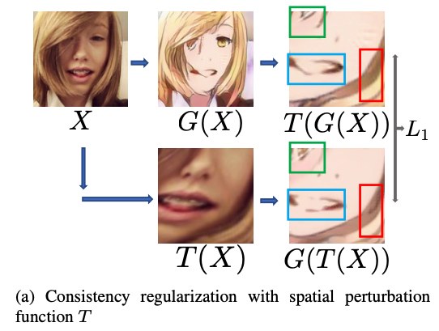
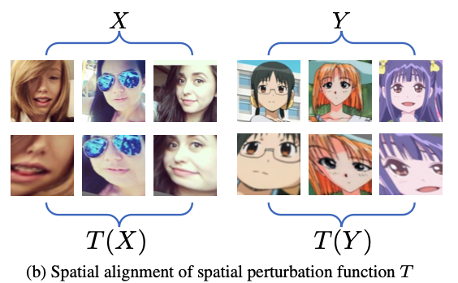
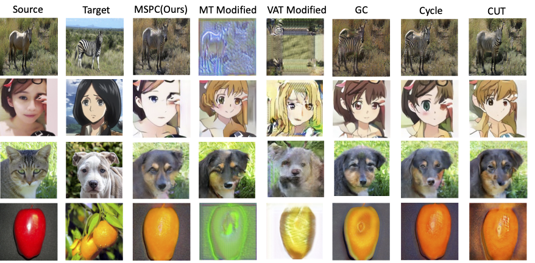
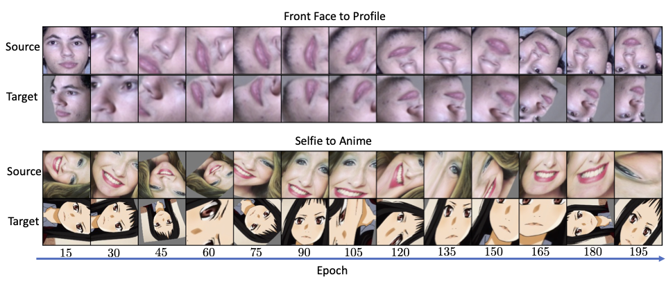

# MSPC for I2I

This repository is by [Yanwu Xu](http://xuyanwu.github.io)
and contains the [PyTorch](https://pytorch.org) source code to
reproduce the experiments in our CVPR2022 paper [Maximum Spatial Perturbation Consistency for Unpaired Image-to-Image Translation](https://arxiv.org/pdf/2203.12707.pdf) by [Yanwu Xu](http://xuyanwu.github.io), Shaoan Xie, Wenhao Wu, Kun Zhang, Mingming Gong* and Kayhan Batmanghelich* (* Equal Contribution)

| Purturbation Consistency | Spatial Alignment |
:-------------------------:|:-------------------------:
  |  

## Face Pose Transfer data can be downloaded [here](https://drive.google.com/file/d/1AUoRl0_suTIunTTJ5jor8poUmkoKfxMb/view?usp=sharing)

## Experiments on real data

To run the code on the face pose transfer data. 1. download the data from above link 2. unzip the data to the ./data folder 3. sh run_gcpert.sh

## Qualitative Results
| Comparison |
:-------------------------:|
  |

## Dynamic of Spatial Transformer T
| Comparison |
:-------------------------:|
  |

# Citation

```
@InProceedings{Xu_2022_CVPR,
    author    = {Xu, Yanwu and Xie, Shaoan and Wu, Wenhao and Zhang, Kun and Gong, Mingming and Batmanghelich, Kayhan},
    title     = {Maximum Spatial Perturbation Consistency for Unpaired Image-to-Image Translation},
    booktitle = {Proceedings of the IEEE/CVF Conference on Computer Vision and Pattern Recognition (CVPR)},
    month     = {June},
    year      = {2022},
    pages     = {18311-18320}
}
```

# Acknowledgments

This work was partially supported by NIH Award Number 1R01HL141813-01, NSF 1839332 Tripod+X, SAP SE, and Pennsylvania Department of Health. We are grateful for the computational resources provided by Pittsburgh SuperComputing grant number TG-ASC170024. MG is supported by Australian Research Council Project DE210101624. KZ would like to acknowledge the support by the National Institutes of Health (NIH) under Contract R01HL159805, by the NSF-Convergence Accelerator Track-D award #2134901, and by the United States Air Force under Contract No. C7715.
